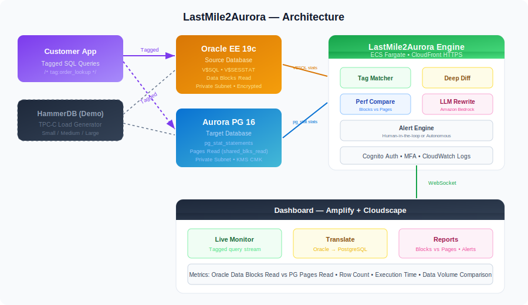

# LastMile2Aurora — Live Migration Performance Watchdog

> **AWS SCT migrates your schema. LastMile2Aurora validates that your migrated queries perform the same on Aurora PostgreSQL — and if they don't, fixes them with AI.**

## The Problem

When customers migrate from Oracle to Aurora PostgreSQL, AWS Schema Conversion Tool (SCT) handles DDL (tables, indexes, constraints). But the **application-layer SQL** — queries embedded in code — is left as manual work. Engineering teams discover broken or slow queries **in production after cutover**. By then it's too late.

**Common issues at cutover:**
- Oracle-specific syntax (`NVL`, `ROWNUM`, `DECODE`, `(+)` joins) fails on PostgreSQL
- Queries that were fast on Oracle are slow on Aurora PG due to plan changes
- Data volume differences between test and production mask real regressions
- No way to prove semantic parity before committing to cutover

## What LastMile2Aurora Does

LastMile2Aurora is a **real-time performance watchdog** that sits between your Oracle source and Aurora PostgreSQL target during migration. It:

1. **Tracks tagged queries** across both databases using SQL comment tags (`/* tag:order_lookup */`)
2. **Compares performance** — Oracle data blocks read vs PostgreSQL pages read, execution times, row counts
3. **Detects regressions** — flags queries that are >20% slower on Aurora PG
4. **Fixes with AI** — Amazon Bedrock (Claude) analyzes the execution plan and rewrites the query for PostgreSQL
5. **Generates reports** — exportable cutover readiness proof for your team

## Architecture



```
   ┌──────────────────┐
   │ Customer App     │  Tagged SQL queries: /* tag:order_lookup */
   │ or HammerDB      │
   └──┬───────────┬───┘
      │           │
      ▼           ▼
┌──────────┐ ┌──────────────┐
│ Oracle   │ │ Aurora PG 16 │
│ EE 19c   │ │ (target)     │
└──┬───────┘ └──────┬───────┘
   │                │
   └──────┬─────────┘
          ▼
   ┌─────────────────────┐
   │ LastMile2Aurora     │
   │ ECS Fargate         │
   │ • Tag Matcher       │
   │ • Deep Diff         │
   │ • Perf Compare      │  ──→  CloudFront (HTTPS)  ──→  Dashboard
   │ • LLM Rewrite       │
   │ • Alert Engine      │
   └─────────────────────┘
```

## Live Demo

**URL:** https://<YOUR_AMPLIFY_URL>


### Demo Flow (2 minutes)

1. **Sign in** → Cognito authentication
2. **Choose mode** → "Demo Mode" (preconfigured) or "Connect Your Databases" (custom)
3. **Select workload** → Small (16 queries, 30s) / Medium (48 queries, 2min) / Large (160 queries, 5min)
4. **Watch live** → Progress bar, streaming results, real-time counters
5. **Review** → Green = passed, Red = regression, Yellow = mismatch
6. **Translate** → Paste any Oracle SQL → instant PostgreSQL translation with 15 Oracle quirks handled
7. **Auto-fix** → Click remediate on any regression → LLM rewrites the query

## How Query Tagging Works

Oracle and PostgreSQL generate **different SQL hashes** for the same logical query (different syntax, different execution plans). The only reliable way to match the same business query across both databases is **tagging**.

### Step 1: Tag your Oracle queries
```sql
-- In your application code (Oracle)
SELECT /* tag:order_lookup */ o.order_id, o.amount, c.name
FROM orders o, customers c
WHERE o.customer_id = c.customer_id(+)
AND o.order_date > SYSDATE - 30
```

### Step 2: Tag the PostgreSQL equivalent
```sql
-- In your migrated code (PostgreSQL)
SELECT /* tag:order_lookup */ o.order_id, o.amount, c.name
FROM orders o
LEFT JOIN customers c ON o.customer_id = c.customer_id
WHERE o.order_date > CURRENT_TIMESTAMP - INTERVAL '30 days'
```

### Step 3: LastMile2Aurora matches by tag
The tool reads `V$SQL` (Oracle) and `pg_stat_statements` (PostgreSQL), extracts the tag from each query, and compares performance metrics for matching tags.

## Performance Metrics Compared

| Metric | Oracle Source | Aurora PG Target |
|--------|-------------|-----------------|
| **I/O** | Data Blocks Read (`V$SQL.disk_reads`) | Pages Read (`pg_stat.shared_blks_read`) |
| **Execution Time** | `V$SQL.elapsed_time` | `pg_stat.total_exec_time` |
| **Rows Processed** | `V$SQL.rows_processed` | `pg_stat.rows` |
| **Executions** | `V$SQL.executions` | `pg_stat.calls` |
| **Data Volume** | ⚠️ Mismatch = likely different test data, not a real regression |

### Why Data Volume Matters

A common false positive: customers test with a subset of production data, then complain about performance differences. If Oracle has 10M rows and Aurora PG has 100K rows, the execution plans will be completely different. LastMile2Aurora flags data volume mismatches so you know when a "regression" is actually a test data issue.

## Oracle Quirks Handled (15)

| Quirk | Oracle | PostgreSQL |
|-------|--------|------------|
| SYSDATE | `SYSDATE` | `CURRENT_TIMESTAMP` |
| DUAL | `FROM DUAL` | *(removed)* |
| NVL | `NVL(x, 0)` | `COALESCE(x, 0)` |
| DECODE | `DECODE(x, 1, 'a', 'b')` | `CASE x WHEN 1 THEN 'a' ELSE 'b' END` |
| ROWNUM | `WHERE ROWNUM <= 10` | `LIMIT 10` |
| (+) outer join | `WHERE a.id = b.id(+)` | `LEFT JOIN b ON a.id = b.id` |
| Sequences | `seq.NEXTVAL` | `nextval('seq')` |
| SUBSTR | `SUBSTR(x, 1, 5)` | `SUBSTRING(x FROM 1 FOR 5)` |
| TRUNC date | `TRUNC(SYSDATE)` | `DATE_TRUNC('day', CURRENT_TIMESTAMP)` |
| TO_DATE | `TO_DATE('2024-01-01', 'YYYY-MM-DD')` | `'2024-01-01'::date` |
| Hints | `/*+ INDEX(e idx) */` | *(removed)* |
| CONNECT BY | Detected, flagged for `WITH RECURSIVE` | Manual review |
| MERGE | Detected, flagged for `INSERT ... ON CONFLICT` | Manual review |
| String concat | `\|\|` | `\|\|` *(compatible)* |
| CLOB/BLOB | Detected | `TEXT` / `BYTEA` |

## Tech Stack

| Component | Technology |
|-----------|-----------|
| **Frontend** | React 18 + Cloudscape Design System + Vite |
| **Backend** | Python 3.11 + FastAPI + Uvicorn |
| **Auth** | Amazon Cognito (MFA optional, self-registration disabled) |
| **Source DB** | Oracle EE 19c on RDS (private subnet, encrypted) |
| **Target DB** | Aurora PostgreSQL 16 (private subnet, KMS CMK) |
| **AI** | Amazon Bedrock (Claude) for query rewriting |
| **SQL Engine** | [sql-migration-optimizer](https://github.com/<YOUR_GITHUB_USER>/sql-migration-optimizer) |
| **Load Generator** | HammerDB 4.x (TPC-C) on EC2 |
| **Hosting** | ECS Fargate + ALB + CloudFront (HTTPS) + Amplify |
| **IaC** | CloudFormation |

## Project Structure

```
lastmile2aurora/
├── infra/                          # CloudFormation templates
│   ├── cloudformation-v1.yaml      # Main stack: VPC, Aurora PG, ECS, ALB, Cognito, KMS, S3
│   ├── oracle-source-v1.yaml       # Oracle EE RDS instance
│   └── hammerdb-ec2-v1.yaml        # HammerDB EC2 load generator
├── backend/                        # Python FastAPI
│   ├── main.py                     # API routes, WebSocket, simulate endpoint
│   ├── auth.py                     # Cognito JWT verification
│   ├── db.py                       # Aurora PG connection pool + schema
│   ├── translator.py               # SQL translation (local engine + Bedrock fallback)
│   ├── oracle_connector.py         # Real Oracle RDS or CSV mock
│   ├── oracle_mock.py              # CSV-backed Oracle simulator
│   ├── validator.py                # Deep diff comparator
│   └── config.py                   # Pydantic settings
├── frontend/                       # React + Cloudscape
│   └── src/
│       ├── pages/                  # auth, dashboard, translate, report
│       ├── hooks/                  # useAuth, useWebSocket
│       ├── lib/                    # auth.ts, api.ts, sql-translator.ts
│       └── components/             # AppLayout
├── hammerdb/                       # HammerDB TPC-C scripts
│   ├── hammerdb_oracle_build.tcl   # Build TPC-C schema on Oracle
│   ├── hammerdb_pg_build.tcl       # Build TPC-C schema on Aurora PG
│   ├── hammerdb_oracle_run.tcl     # Run load on Oracle (parameterized)
│   ├── hammerdb_pg_run.tcl         # Run load on Aurora PG (parameterized)
│   └── start_load.sh              # Wrapper: small/medium/large profiles
├── mock-workload/                  # Demo data
│   ├── data/                       # CSV: employees, departments, orders
│   ├── demo_queries.json           # 16 tagged Oracle queries with PG translations
│   ├── seed.py                     # Seed both databases
│   └── traffic_generator.py        # Continuous load generator
├── sql-migration-optimizer/        # SQL conversion engine (from github.com/<YOUR_GITHUB_USER>/)
├── workshop/                       # Deployment logs for Workshop Studio
├── Dockerfile                      # Backend + frontend container
└── README.md                       # This file
```

## Deployment

### Prerequisites
- AWS account with Bedrock access (Claude models)
- AWS CLI v2 configured
- Docker

### Deploy Infrastructure
```bash
# Main stack (VPC, Aurora PG, ECS, ALB, Cognito, KMS, S3)
aws cloudformation create-stack \
  --stack-name rgs-lastmile-v1 \
  --template-body file://infra/cloudformation-v1.yaml \
  --capabilities CAPABILITY_NAMED_IAM \
  --parameters ParameterKey=DBPassword,ParameterValue=<password>

# Oracle EE
aws rds create-db-instance \
  --db-instance-identifier rgs-lastmile-oracle-ee-v1 \
  --engine oracle-ee --license-model bring-your-own-license \
  --db-instance-class db.r5.large --allocated-storage 50 \
  --master-username oracleadmin --master-user-password <password> \
  --db-name LASTMILE --no-publicly-accessible --storage-encrypted \
  --vpc-security-group-ids <oracle-sg-id> --db-subnet-group-name <subnet-group>

# HammerDB EC2
aws cloudformation create-stack \
  --stack-name rgs-lastmile-hammerdb-v1 \
  --template-body file://infra/hammerdb-ec2-v1.yaml \
  --capabilities CAPABILITY_NAMED_IAM \
  --parameters ParameterKey=VpcId,ParameterValue=<vpc-id> ...
```

### Build & Deploy Backend
```bash
# Login to ECR
aws ecr get-login-password | docker login --username AWS --password-stdin <account>.dkr.ecr.us-east-1.amazonaws.com

# Build and push
docker build -t rgs-lastmile-v1 .
docker tag rgs-lastmile-v1:latest <account>.dkr.ecr.us-east-1.amazonaws.com/rgs-lastmile-v1:latest
docker push <account>.dkr.ecr.us-east-1.amazonaws.com/rgs-lastmile-v1:latest

# Force ECS redeploy
aws ecs update-service --cluster rgs-lastmile-cluster-v1 --service rgs-lastmile-svc-v1 --force-new-deployment
```

### Seed Databases
```bash
# Via ECS one-off task
aws ecs run-task --cluster rgs-lastmile-cluster-v1 --task-definition rgs-lastmile-task-v1 \
  --launch-type FARGATE --network-configuration '...' \
  --overrides '{"containerOverrides":[{"name":"lastmile-api","command":["python3","/app/mock-workload/seed.py","both"]}]}'
```

### Run HammerDB Load
```bash
# SSM into EC2
aws ssm start-session --target <instance-id>

# Build TPC-C schema
/opt/hammerdb/hammerdbcli auto /opt/hammerdb/scripts/hammerdb_oracle_build.tcl
/opt/hammerdb/hammerdbcli auto /opt/hammerdb/scripts/hammerdb_pg_build.tcl

# Run load
cd /opt/hammerdb/scripts
./start_load.sh small    # 6 min, 2 virtual users
./start_load.sh medium   # 30 min, 4 virtual users
./start_load.sh large    # 60 min, 8 virtual users
```

### Create Admin User
```bash
aws cognito-idp admin-create-user --user-pool-id <pool-id> \
  --username admin@example.com --temporary-password TempPass1! \
  --message-action SUPPRESS \
  --user-attributes Name=email,Value=admin@example.com Name=email_verified,Value=true

aws cognito-idp admin-set-user-password --user-pool-id <pool-id> \
  --username admin@example.com --password <permanent-password> --permanent

aws cognito-idp admin-add-user-to-group --user-pool-id <pool-id> \
  --username admin@example.com --group-name admin
```

## Security & Compliance (Epoxy/Orthanc)

| Control | Status | Implementation |
|---------|--------|---------------|
| RDS not publicly accessible | ✅ | `PubliclyAccessible: false` on both Oracle and Aurora |
| Private subnets for compute + DB | ✅ | ECS Fargate + RDS in private subnets with NAT Gateway |
| Storage encryption (KMS CMK) | ✅ | Aurora, S3, ECR all use KMS CMK with key rotation |
| Backup retention ≥7 days | ✅ | Aurora: 7 days, Oracle: 7 days |
| Fargate over EC2 | ✅ | ECS Fargate for backend (EC2 only for HammerDB) |
| SG chaining | ✅ | CloudFront → ALB → ECS → Aurora/Oracle (no shortcuts) |
| ALB not open to 0.0.0.0/0 | ✅ | Restricted to CloudFront managed prefix list (`pl-3b927c52`) |
| Cognito MFA | ✅ | Optional TOTP MFA enabled |
| Cognito self-registration disabled | ✅ | `AllowAdminCreateUserOnly: true` |
| JWT verification on all API routes | ✅ | Every `/api/*` endpoint verifies Cognito JWT |
| S3 hardened | ✅ | Block public access, versioning, KMS SSE, deny non-SSL policy |
| CloudWatch logs | ✅ | 14-day retention |
| ECR scan on push | ✅ | Enabled |
| No hardcoded secrets | ✅ | All via env vars, CloudFormation `NoEcho`, or Cognito |
| HTTPS everywhere | ✅ | CloudFront with default certificate, redirect HTTP→HTTPS |
| Multi-user isolation | ✅ | Each workload run gets unique `run_id`, results scoped per user |

## Multi-User Support

Multiple users can run workloads simultaneously. Each execution gets a unique `run_id` that scopes all performance snapshots, alerts, and reports to that session. No data mixing between users.

## Cleanup

```bash
# Delete in reverse order
aws cloudformation delete-stack --stack-name rgs-lastmile-hammerdb-v1
aws rds delete-db-instance --db-instance-identifier rgs-lastmile-oracle-ee-v1 --skip-final-snapshot
aws cloudformation delete-stack --stack-name rgs-lastmile-v1
aws amplify delete-app --app-id <AMPLIFY_APP_ID>
aws cloudfront delete-distribution --id <CLOUDFRONT_DIST_ID> --if-match <etag>
```

## Related Projects

- [sql-migration-optimizer](https://github.com/<YOUR_GITHUB_USER>/sql-migration-optimizer) — Core SQL conversion engine
- [mcp-sql-optimizer](https://github.com/<YOUR_GITHUB_USER>/mcp-sql-optimizer) — MCP server for AI-assisted SQL optimization
- [cloud-demo-generator-v2](https://github.com/<YOUR_GITHUB_USER>/cloud-demo-generator-v2) — Cognito auth pattern reference

## Future Enhancements

### 🎯 High-Impact (Next Sprint)

| # | Feature | Description | Impact |
|---|---------|-------------|--------|
| 1 | **Apply & Verify AI Fix** ✅ *Shipped* | After AI generates a rewritten SQL, user clicks "Apply & Verify". Backend runs both original and rewritten SQL against Aurora PG, compares execution time, blocks read, and row count. Shows before/after diff with verdict (improved / neutral / worse / invalid) and Accept/Reject. Closes the loop from detection to verified fix. | Proves the AI fix actually works — not just suggested |
| 2 | **Tag Auto-Injector** | CLI that scans source files (Python, Java, Go), finds SQL literals, and auto-injects stable tags derived from query shape hash. `lastmile2aurora tag ./src/` — 60-second command. Removes the manual tagging burden. | Turns a manual ritual into automation |
| 3 | **Regression Root-Cause Narrative** | When regression detected, LLM fetches both execution plans, compares them, returns: plain-English diagnosis, suspected root cause (missing index, stale stats, plan quirk), specific remediation (`CREATE INDEX ...`), and expected impact estimate. | Turns detector into consultant |
| 4 | **Pre-Cutover Readiness Scorecard** | Holistic confidence score (0-100): % queries passing, un-remediated regressions, data volume parity, coverage %, critical-path query status. "Ready to Cut Over" traffic-light badge. Expose as API for CI/CD gating. | Single number for leadership approval |

### 🔧 Expand Dialect & Workload Surface

| # | Feature | Description |
|---|---------|-------------|
| 5 | **SQL Server Source** | Extend to T-SQL: `GETDATE`, `TOP`, `CROSS APPLY`, `TRY/CATCH`, `MERGE`, CTE syntax. Doubles TAM — "commercial DB → Aurora PG" pitch. |
| 6 | **Aurora MySQL Target** | Support MySQL 8 as target dialect. Many SCT migrations go Oracle/MSSQL → Aurora MySQL. |
| 7 | **Babelfish Mode** | Validate T-SQL passthrough via Aurora PG + Babelfish. Premium AWS talking point for SQL Server cohort. |

### 📊 Data & Observability

| # | Feature | Description |
|---|---------|-------------|
| 8 | **Production Workload Replay** | Capture mode: read Oracle `V$SQL_HISTORY` or AWR dumps. Replay mode: rerun exact queries against Aurora PG. Compare production distribution, not synthetic. |
| 9 | **Continuous Watchdog Mode** | Runs every N minutes during/after cutover. Samples tagged queries from `pg_stat_statements` / `V$SQL`. Detects drift at week 2 due to data growth. Alerts via SNS/Slack. Extends from "pre-cutover validator" to "post-cutover guardian." |
| 10 | **Historical Trend View** | Query performance over time (line graph per tag). Regression rate trending down as fixes applied. Cutover-readiness score over time. |

### 🤖 AI / LLM Enhancements

| # | Feature | Description |
|---|---------|-------------|
| 11 | **Self-Correcting Auto-Fix Loop** | LLM rewrites → auto-execute → rerun perf comparison → accept only if threshold met. Retry up to N iterations with prior failure as context. Query optimizer agent. |
| 12 | **Index Recommendation Engine** | Analyze whether an index would help, propose `CREATE INDEX`. Use `hypopg` for hypothetical index validation before suggesting. |
| 13 | **Statistics / Autovacuum Advisor** | Run `pg_stats` analysis, flag stale or misconfigured tables (`n_distinct`, `default_statistics_target`, autovacuum settings). Huge source of "mystery" regressions. |
| 14 | **Session Variable / GUC Tuner** | Propose and test session-level GUC changes (`work_mem`, `enable_hashagg`). Some regressions go away with a single `SET`. |

### 🔌 Integrations

| # | Feature | Description |
|---|---------|-------------|
| 15 | **AWS DMS Integration** | Hook into DMS CDC stream: detect schema drift, row count divergence, replication lag. Full "DMS post-flight check." |
| 16 | **SCT Assessment Import** | Import SCT assessment report → auto-prioritize queries by SCT complexity score. Closes the loop with SCT. |
| 17 | **Q Developer / Kiro Plugin** | Inline translator while editing code. Highlight Oracle-isms with squiggly lines, one-click PG translation. |
| 18 | **CI/CD Gate (GitHub Action / GitLab CI)** | Containerized CLI for pipelines: `lastmile2aurora-action@v1` with `min-score: 95`. Tool becomes part of deploy pipelines. |

### 🎨 UX / Polish

| # | Feature | Description |
|---|---------|-------------|
| 19 | **Side-by-Side Plan Diff View** | Oracle plan vs PG plan with color coding (green = same, red = different). |
| 20 | **"Explain This Failure" Assistant** | Free-text chat with query context loaded. User asks "why is this slow?" → LLM responds with full context. |
| 21 | **Export to PDF Report** | One-click executive summary: readiness score, regression count, remediation status, risk items. |

### 🏢 Enterprise / Scale

| # | Feature | Description |
|---|---------|-------------|
| 22 | **Multi-Tenancy & RBAC** | Tenant/org model in Cognito, role-based views (DBA vs dev vs exec), SSO (SAML/OIDC), audit log. |
| 23 | **Workload Profile Library** | Industry-standard workloads: TPC-H, TPC-DS, YCSB, sysbench. Pick closest to your workload. |
| 24 | **Cost Projection Panel** | "If you cut over today, Aurora spend estimated at $X/mo." Uses performance data + Aurora pricing model. |

### 💡 Ambitious / Game-Changers

| # | Feature | Description |
|---|---------|-------------|
| 25 | **Shadow-Cutover Mode** | Dual-write proxy to both Oracle and Aurora PG for N days. Compare in real time. If parity holds, cutover is automatic. Holy grail of risk-free migration. |
| 26 | **Auto-Generate Migration Playbook** | After validation run, generate markdown playbook: which queries need attention, which indexes to create, which stats to refresh, in what order. Hand-holdable to a junior engineer. |
| 27 | **pg_tle / Custom Extension Parity Checker** | If Oracle uses custom PL/SQL packages, check whether PG extensions (`pg_tle`, `plv8`, `plrust`) cover the same functionality. Flag gaps SCT can't solve. |

## License

MIT-0

---

*Built with [Kiro](https://kiro.dev) in AgentSpaces — powered by Claude*
